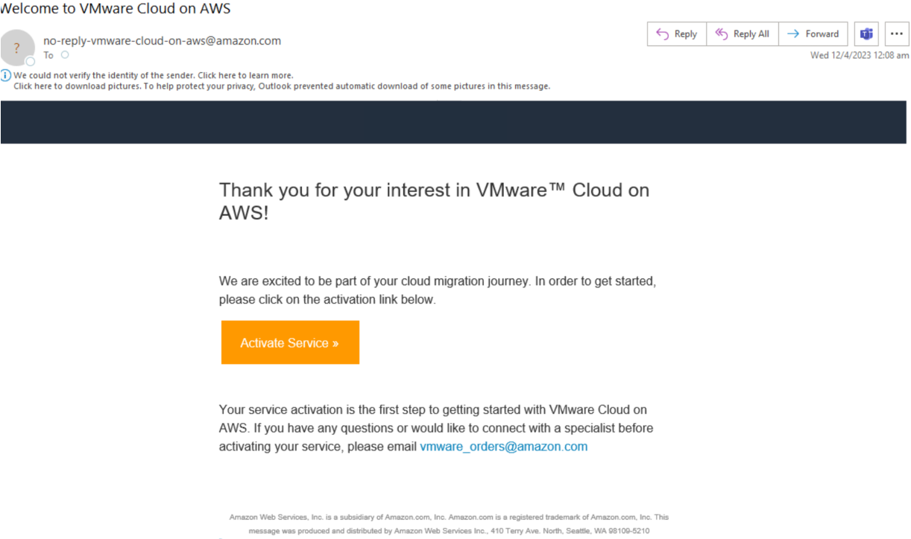
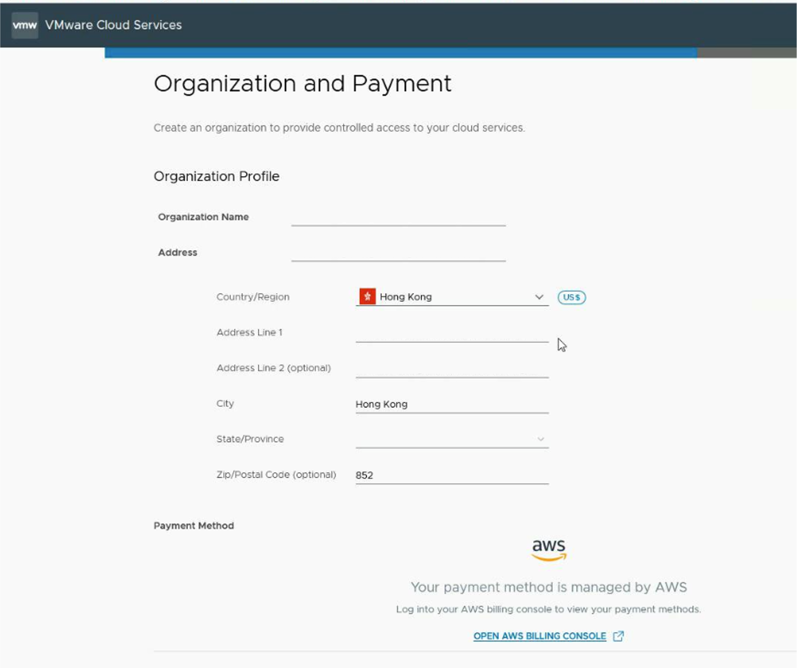

# Prepare the VMware Cloud Organization ID 
1.	Sign in [AWS Console](https://us-east-1.console.aws.amazon.com/console/home) with project or billing account.
2.	Sign up VMC on AWS by clicking [Get started with VMware Cloud on AWS](https://aws.amazon.com/vmware/).

    

3.	Fill the Sign Up form for VMC on AWS.

    

    

4.	Receive confirmation email and wait for request review (around 6-12 hours).

    

5.	Receive Welcome Email and activate VMware Cloud account.

    

6.	Setup a new Organisation (if no existing one) in VMware Cloud Console.

    

7.	Review the Organisation ID in VMware Cloud Console.
